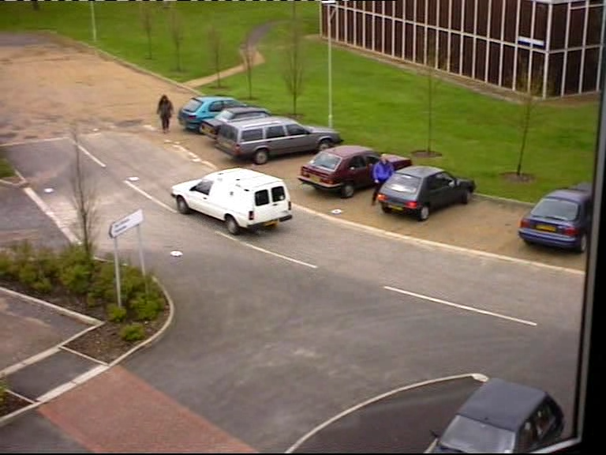
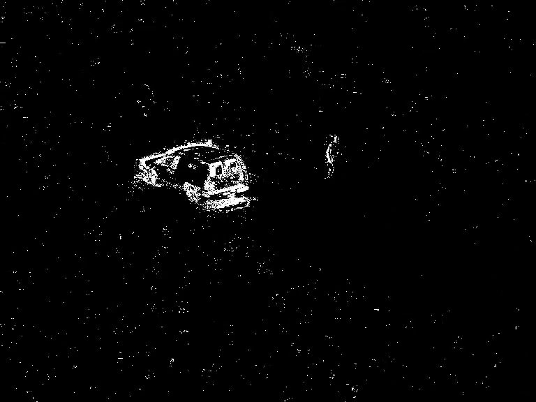

# PyGMM

Python code for Guassian Mixture Models, using for video background modeling, based on the paper of Stauffer, C. and W. E. L. Grimson (1999).

# Dependency

1. Python 3.6.2
2. Python OpenCV 4.2.0

# Usage

```console
PyGmm.py -i D:/video/test5.mp4 -o outpy.mp4
```

# Test Result

You can use surveillance videos to test the code. Here is my example of test Result:

Original video screenshot:



The Guassian Background substraction result:




# TODO

1. The speed is very slow and should make something up to speed it.

2. Connect components and filter noise pixels.

3. Add Kalman filters to track the moving objects. 

# Reference

1. Stauffer, C. and W. E. L. Grimson (1999). Adaptive background mixture models for real-time tracking, IEEE.

2. KaewTraKulPong, P. and R. Bowden (2001). An improved adaptive background mixture model for real-time tracking with shadow detection.
